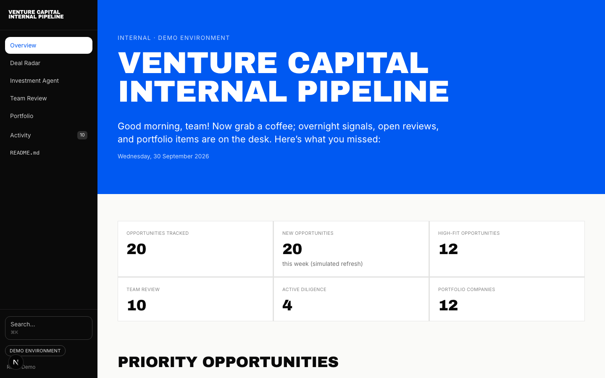
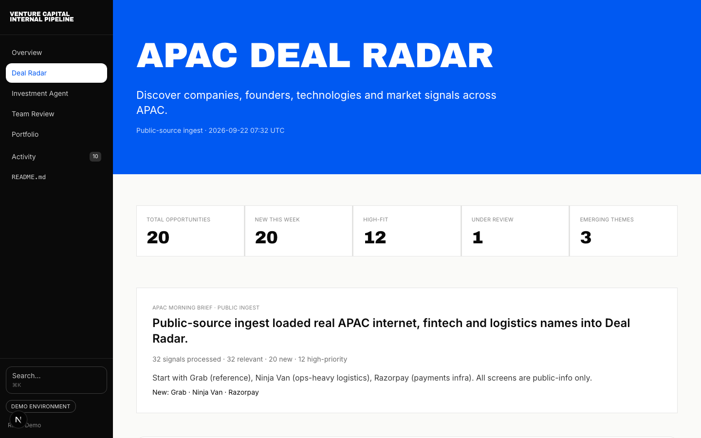
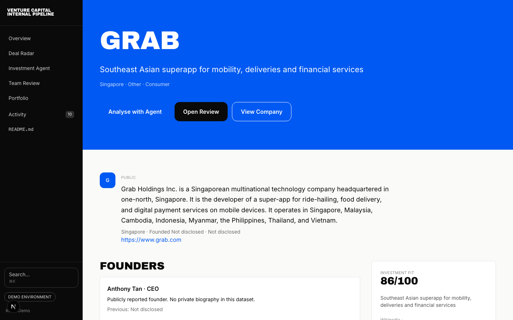
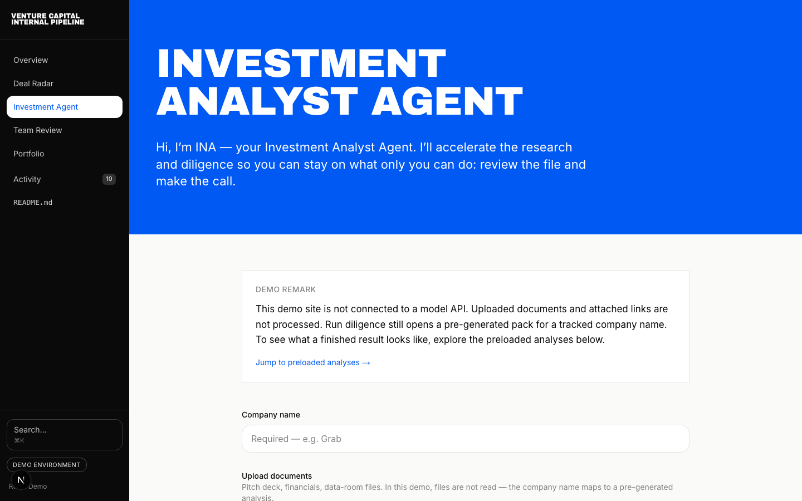
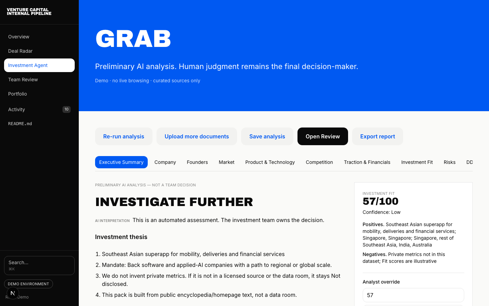
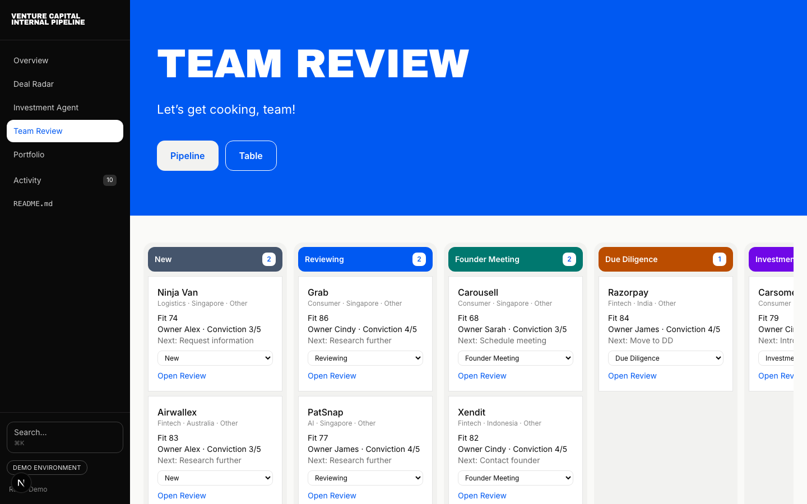
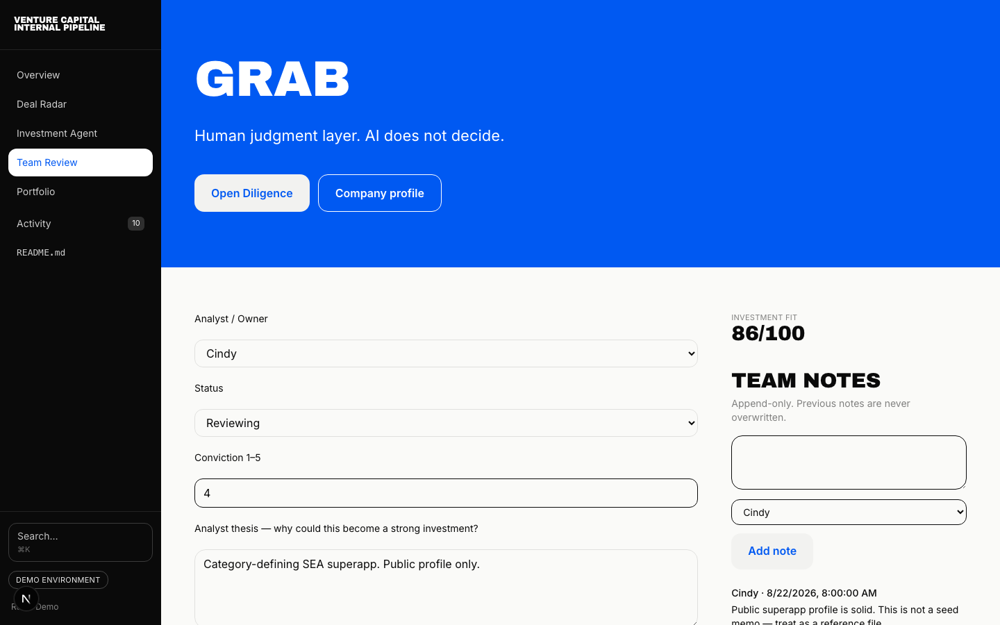
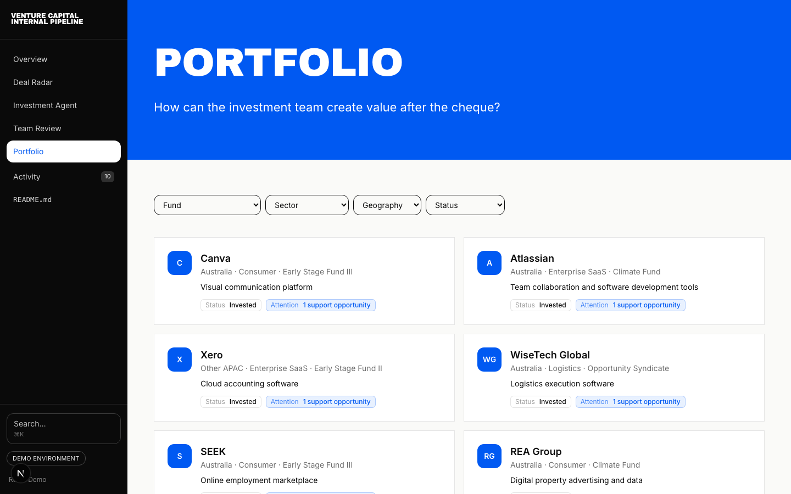
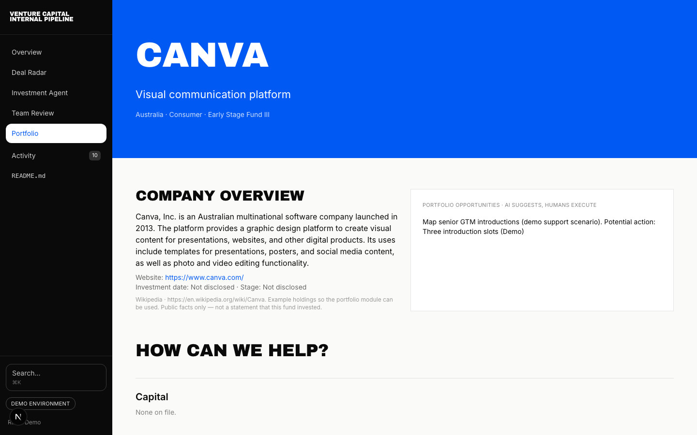

# Venture Capital Internal Pipeline

Open-source venture capital OS — **Discover → Diligence → Decide → Support**.

The UI is a full pipeline. The default data layer is a **one-time public ingest** (Wikipedia + Wikidata + official homepages), not Crunchbase and not synthetic LumenGrid-style names.

**Live demo:** https://vc-internal-pipeline.vercel.app/

In-app walkthrough: [/readme](https://vc-internal-pipeline.vercel.app/readme)  
How to personalize the code: [docs/CUSTOMIZE.md](docs/CUSTOMIZE.md) — grep `CUSTOMIZE:` in the repo for every fork point (team, mandate, ingest, providers, INA, persistence, branding).

## What it is

- **Overview** — morning desk
- **Deal Radar** — sourcing and filters
- **INA** — diligence runner (loads a pre-built pack; no model API in the demo)
- **Team Review** — CRM pipeline, conviction, invest / pass
- **Portfolio** — value-creation work

Unknowns stay `Not disclosed`. Fit scores are illustrative public-info screens, not a licensed research product.

## Product walkthrough

Screenshots are the live UI (Venture Capital Internal Pipeline, public-source ingest). Recapture with `node scripts/capture-readme.js` while `npm run dev` is running.



















## Run locally

```bash
npm install
npm run ingest    # refresh Wikipedia / homepage extracts
npm run dev
```

Open [http://127.0.0.1:3000](http://127.0.0.1:3000). Search **Grab**, **Ninja Van**, **Razorpay**, **Canva**.

## License

MIT. See [LICENSE](LICENSE). Wikipedia text inside `src/data/ingested.json` remains CC BY-SA.
